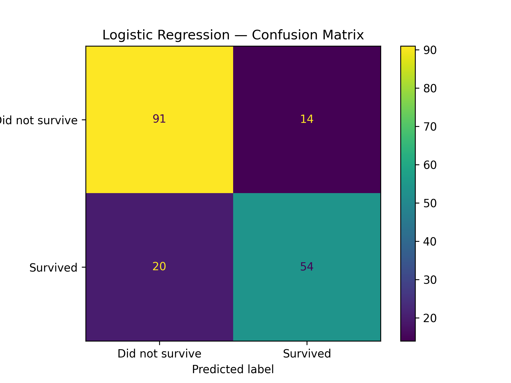
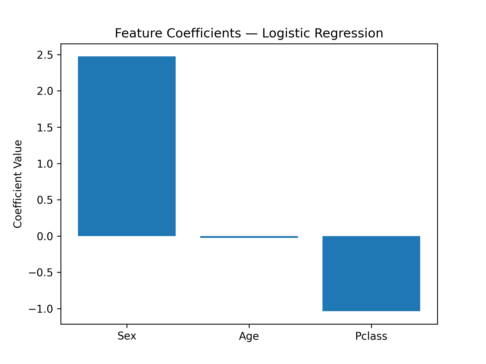

# Titanic Survival Prediction (ML Classification Project)

## Overview
An end-to-end machine learning project predicting passenger survival on the Titanic 
using the Kaggle Titanic dataset. Covers data cleaning, exploratory data analysis, 
feature engineering, and multi-model comparison.

## Key Finding
Gender was by far the strongest predictor of survival (coefficient = 2.48), more 
than twice as influential as passenger class. The model independently rediscovered 
the historical "women and children first" protocol purely from raw passenger data, 
without being explicitly told.

## What I Did
- **Data Cleaning**: Handled missing values (Age filled with median, Cabin dropped 
  due to 77% missing data)
- **Exploratory Data Analysis**: Visualised survival rates by gender, passenger 
  class, age group and overall distribution
- **Feature Engineering**: Label encoded Sex column, selected most predictive 
  features
- **Model Training**: Trained and compared 3 classification algorithms
- **Model Evaluation**: Evaluated using accuracy, precision, recall, F1-score and 
  confusion matrix

## Results

| Model | Accuracy |
|---|---|
| Logistic Regression | 81.0% |
| Random Forest | 79.3% |
| Decision Tree | 77.7% |


**Best Model: Logistic Regression (81% accuracy)**





### Classification Report — Logistic Regression
| Class | Precision | Recall | F1-Score |
|---|---|---|---|
| Did not survive | 0.82 | 0.87 | 0.84 |
| Survived | 0.79 | 0.73 | 0.76 |


### What the Model Learned
- **Sex (coefficient: +2.48)**: Being female was the single strongest survival 
  predictor — the model learned the "women and children first" protocol from data alone
- **Pclass (coefficient: -1.02)**: Higher class number (lower social class) strongly 
  decreased survival probability — wealth determined lifeboat access
- **Age (coefficient: ~0.0)**: Minimal independent effect once sex and class are 
  accounted for

## Tech Stack
- Python, pandas, numpy, matplotlib, seaborn
- scikit-learn (LogisticRegression, RandomForestClassifier, DecisionTreeClassifier)

## Project Structure
```
titanic/
│
├── train.csv
├── titanic.py
└── README.md
```

## Dataset
[Kaggle Titanic Competition](https://www.kaggle.com/competitions/titanic)

